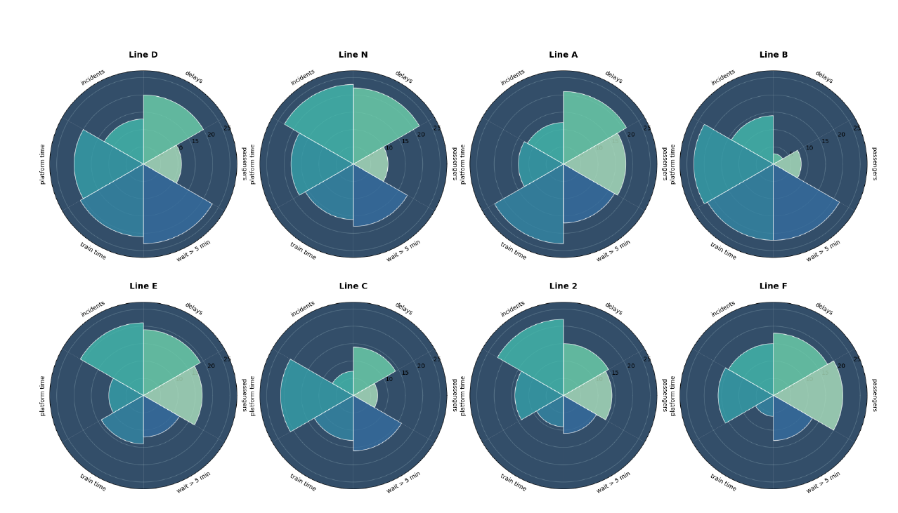
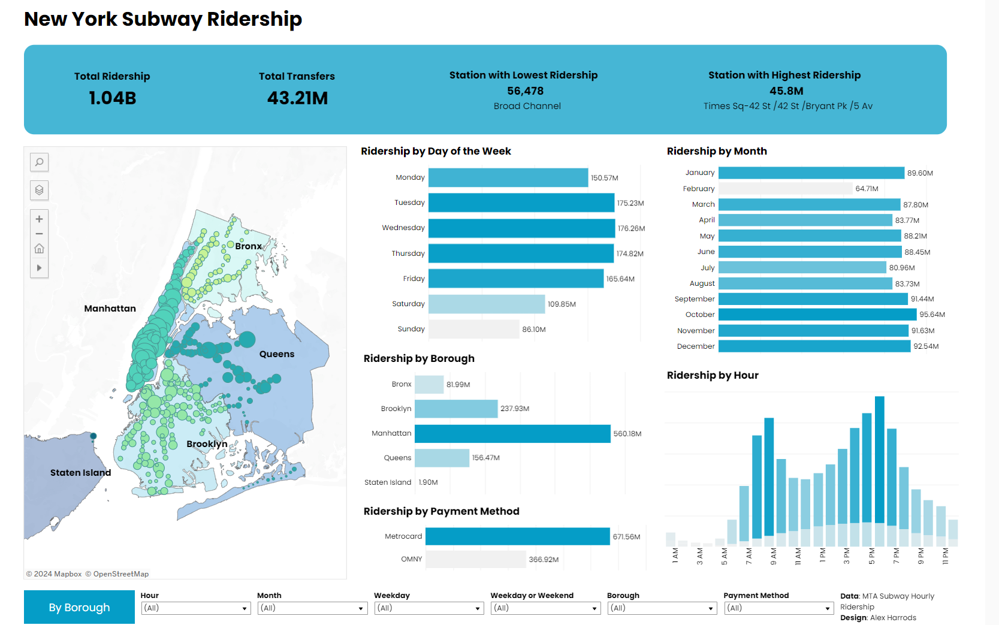
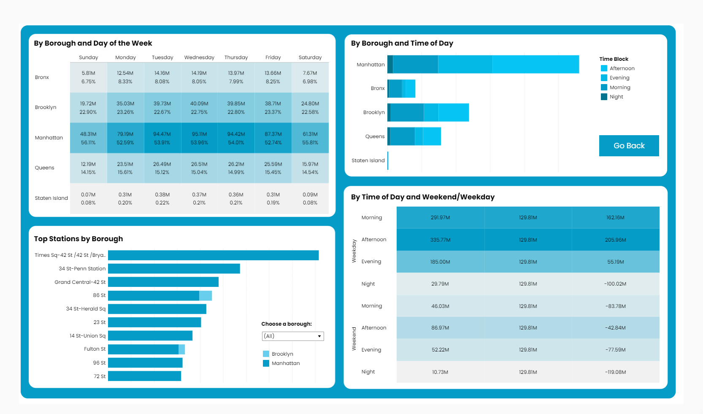

# Portfolio
---
## Data Analytics
### Worst-Performing NYC Subway Lines in 2023 Through Comprehensive EDA

This project identified 5 worst-performing subway lines in New York City in 2023 through a comprehensive Exploratory Data Analysis using datasets from the Metropolitan Transportation Authority (MTA). The analysis was based on data on train delays, major incidents, and customer journey metrics, and provided valuable insights into the performance of various subway lines.

The findings also revealed patterns of delays and incidents, highlighted the impact of major incidents on specific lines, and assessed passenger journey completion times. The project provided actionable insights that have the potential to significantly improve the efficiency of NYC's subway system and help stakeholders pinpoint areas in need of intervention.

 

### Gender Pay Gap Analysis at The Ohio State University: A Statistical and Visualization Approach

In order to analyze gender pay disparities, I first examined The Ohio State University 2023 Combined Earnings dataset, which includes non-student employees’ compensation details like regular pay, overtime, bonuses, and gross pay.

Then, I used Pandas and NumPy for data manipulation, alongside Matplotlib and Seaborn to visualize the data through bar plots, count plots, box plots, and heatmaps.

Finally, I conducted statistical tests, including the Chi-Square Test and Mann-Whitney Test, revealing significant gender pay disparities, underrepresentation of females in higher pay brackets, and inequalities in overtime distribution.

 

 

### Ohio State University Earnings 2023: EDA and Regression Models

I conducted Exploratory Data Analysis on the Ohio State University 2023 Combined Earnings dataset to explore earnings, distribution and other disparities using Pandas, NumPy, Matplotlib, Seaborn, and Plotly.

Then, I applied machine learning techniques like the Isolation Forest to detect and analyze outliers. Finally, I trained regression models, including Huber Regression, Random Forest, and Decision Tree, to handle extreme outliers

 

 

## Tableau
### New York Subway Ridership Visualization

In order to understand ridership patterns across New York subway systems, I gathered data on subway rides and ridership from various time frames, by different boroughs and payment methods. I created Tableau dashboards to visualize ridership behavior and trends, providing insights for transit planning and dynamics.

 

 

 

### Iowa Liquor Sales: Visualization

This Tableau project offers an in-depth analysis of liquor sales across Iowa, with a focus on performance metrics such as sales, profit, and profit ratios. It includes detailed breakdowns by product categories (e.g., cordials, liqueurs) and provides comparisons with other liquors. Key insights include sales performance by store and county, along with visualizations of outliers and trends in bottle and liter sales. Interactive filters allow users to explore data based on specific cities, dates, and categories, making this project a powerful tool for monitoring and understanding regional sales dynamics.

 

 

 

 

## Designed and developed by me

Besides my interest in data analytics, I have a great passion for typography and graphic design. Below are some of the workbooks I created, which are widely used by English learners in Siberia. 

 

 

 
---
